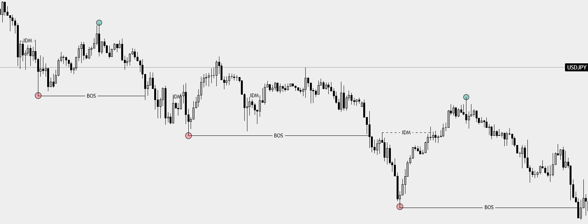

# Break of Structure (BOS)

---

## Definition
A **Break of Structure (BOS)** occurs when price **breaks a key structural level in the direction of the prevailing trend**, confirming continuation.

- In an **uptrend** → BOS = break of the previous **Higher High (HH)**
- In a **downtrend** → BOS = break of the previous **Lower Low (LL)**

BOS confirms that the current trend is still valid.

---

## Conditions for Valid BOS

### 1️⃣ Structure Context
- Trend must already be defined using HH/HL or LL/LH
- BOS is **continuation**, not reversal
- Watch an Expansion case for Structural BOS

---

### 2️⃣ Candle Closure
- Price must **close above the HH** (uptrend)
- Price must **close below the LL** (downtrend)
- Wicks alone are not sufficient

---

### 3️⃣ Pullback Requirement (IDM / HL / LH)
- Before BOS, price should form:
  - **Higher Low (HL)** in an uptrend  
  - **Lower High (LH)** in a downtrend  
- This pullback represents **inducement (IDM)**

Without inducement, BOS is weaker and more prone to failure.

---

## What BOS Is NOT
- BOS is **not** a liquidity sweep
- BOS is **not** a reversal signal
- BOS is **not** defined by indicators

---

## Visual Example

The marked candle closes beyond the previous structural level, confirming continuation.

---

## Key Notes
- BOS confirms **trend continuation**
- CHoCH signals **potential reversal**
- Always identify HTF structure before LTF BOS

---

## Rule Extracted
Only consider continuation trades after a valid BOS with candle close and prior inducement.
